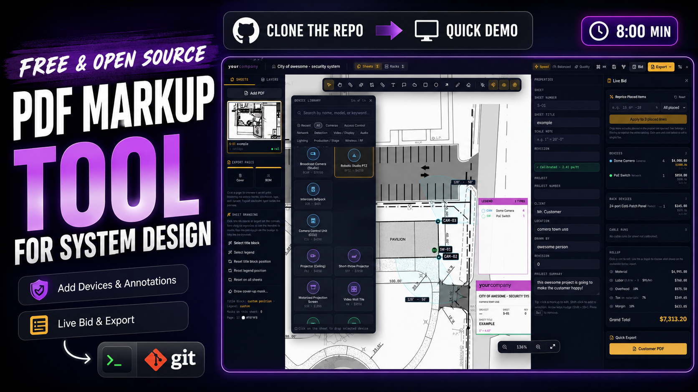
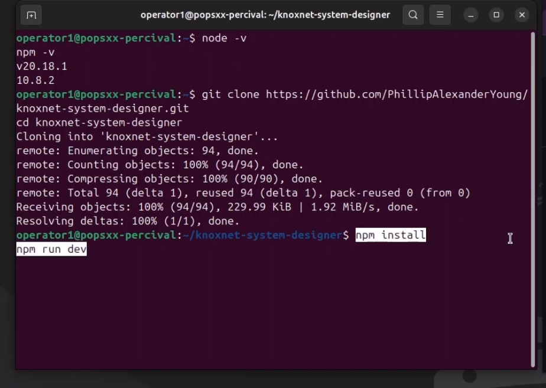
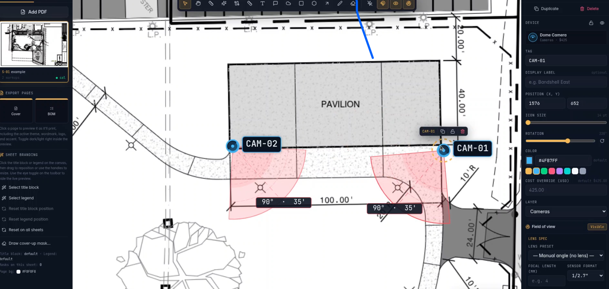
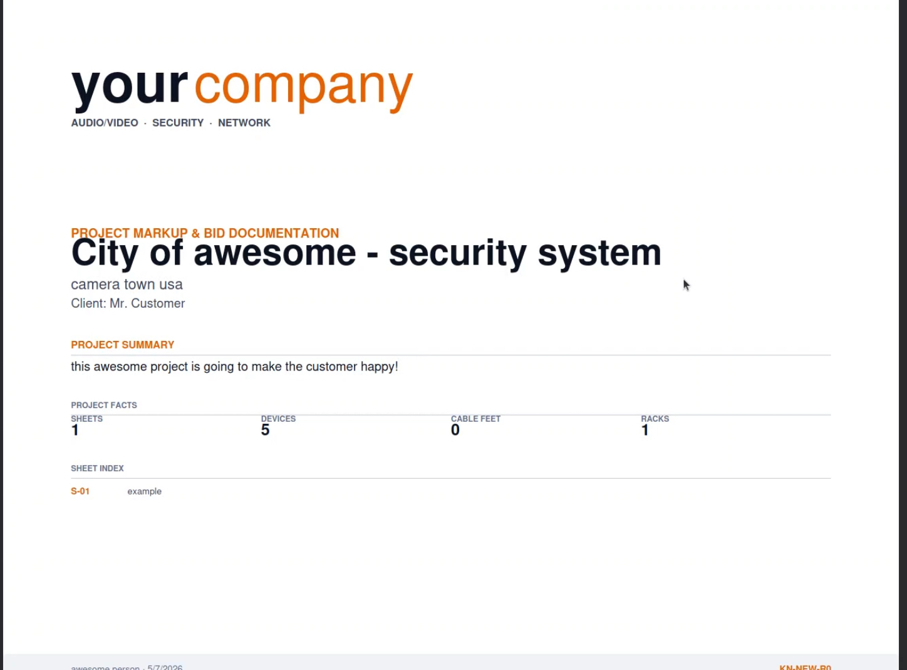

# Knoxnet System Designer

Free, browser-based multi-format drawing markup, device layout, custom
reporting, and bid generator for AV, security, low-voltage, and network
system designers.

Drop in any architectural, civil, or MEP drawing — **PDF, DXF, SVG, PNG,
JPG, WebP, or TIFF** — calibrate scale, place devices with real ports and
IP addresses, run cable, generate any custom report you can describe, and
export a fully branded deliverable plus a real bid. It runs locally in
your browser: no server, no account, and no project data leaving your
machine.

[](LICENSE)

## Demo

The demo shows the core workflow: install from GitHub, import a PDF plan,
place devices, review coverage, and export branded project documentation.


[Watch the 8-minute startup and quick demo video on YouTube.](https://www.youtube.com/watch?v=HnLf3ZR60c4)

<p align="center">
  <a href="https://www.youtube.com/watch?v=HnLf3ZR60c4">
    
  </a>
</p>

<p align="center">
  
  
</p>

<p align="center">
  
</p>

## What It Does

Knoxnet System Designer turns any architectural drawing into a working
system-design, commissioning, reporting, and estimating canvas. You can
mark up drawings, place devices with full network and physical-port
records, run measured cable paths, generate any custom report from the
commissioning data, view the system as a signal-flow diagram, and ship
customer-facing deliverables without sending project files to a hosted
backend.

Typical workflow:

1. **Create** a project with project number, client, and location.
2. **Add drawings** — PDF, DXF, SVG, or raster. The file picker accepts
   every supported format.
3. **Calibrate** the first sheet: hit `K`, click two ends of a known
   dimension, and type the real distance. Required for DXF/raster (PDFs
   carry their own units).
4. **Place devices**: open the palette (`D`), pick a device, and click
   the sheet. Tags auto-increment.
5. **Commission**: open the Properties panel and fill in IP / VLAN /
   MAC / RTSP / model / serial / mount. Connections pick from a real
   port dropdown (ETH0, RS-485, SFP+, …) instead of free text.
6. **Run cable** (`C`): choose a cable type, click vertices, and
   double-click to finish. The length pill updates live.
7. **Annotate** with text, callouts, revision clouds, dimensions,
   arrows, rectangles, polygons, and freehand notes.
8. **Reports**: switch to the **Reports** tab in the left rail. Run a
   bundled starter template (Camera Commissioning Sheet, AP IP Plan,
   Cable Schedule, Switch Port Map, VLAN Report, Door Schedule, Rack
   Loadout, Port Inventory, …) or build your own — pick scope, filter,
   columns, group, sort — and generate as **PDF, XLSX, CSV, JSON,
   Markdown, or HTML** in one click.
9. **Diagrams**: switch to the **Diagrams** view in the topbar to see
   every device + connection as a draggable signal-flow diagram.
10. **Open the Bid panel** (`Cmd/Ctrl+B`) to review material, labor,
    overhead, tax, margin, and grand total.
11. **Tune rates** in Settings (`Cmd/Ctrl+,`).
12. **Export** a branded markup PDF, bid PDF, editable XLSX workbook,
    any saved custom report, or a portable `.knoxnet` project file.

## Who It's For

- AV, security, low-voltage, and network system designers.
- Integrators who need quick plan markup plus a bid from the same
  drawing.
- Estimators who want device counts, cable schedules, and labor totals
  while they sketch.
- Commissioning crews who need real per-device IP / VLAN / port records
  generated as a printable sheet on day one.
- Small teams that prefer a local-first browser tool over an
  account-based hosted app.

## Features

| Capability | Notes |
|---|---|
| **Multi-format ingest** | PDF, DXF (2D AutoCAD vectors), SVG, raster (PNG / JPG / WebP / TIFF). Drop in any drawing — sheets render natively, no server conversion. |
| **DWG → DXF workflow** | DWG is proprietary; export to DXF in your CAD tool (or the free ODA File Converter) and drop the DXF here. |
| Multi-sheet projects | Drag in any number of files; each becomes a navigable sheet with a thumbnail. |
| Scale calibration | Click two points on a known dimension, type the real distance. Per-sheet, recoverable. Required for DXF/raster (PDFs carry their own units). |
| Distance estimating | Cable runs, dimensions, and the cursor coordinates all read out in feet. |
| Device library | 60+ device types: cameras, access control, network, detection, A/V, audio, lighting, broadcast, site/fiber. |
| **Structured ports** | Every device exposes real physical ports (ETH0, RS-485, SFP+, audio in/out, …) with PoE direction + speed. Connections pick a port from a dropdown instead of free text. |
| **Per-instance commissioning** | Full IP / VLAN / MAC / RTSP / NVR channel / switch port / asset tag / firmware on every placed device. Travels in the `.knoxnet` file. |
| Auto-numbering | Devices get tags like CAM-01, AP-03, NID-02 automatically per-sheet. |
| Cable types | Cat6, Cat6A, Cat6 plenum, single/multi-mode fiber, RG6 coax, low-voltage, EMT conduit. Configurable slack %. |
| Markup tools | Select, pan, calibrate, device, cable, dimension, text, callout, revision cloud, rectangle, polygon, arrow, freehand. All vector. |
| Layers | Auto-layered by category: show, hide, or lock independently. |
| Live bid engine | BOM + cable schedule + labor + overhead + tax + margin + grand total. Updates as you draw. |
| **Custom report builder** | View-builder UX: pick a scope (devices / cables / connections / racks / ports), filter, pick columns, group, sort, generate as **PDF, XLSX, CSV, JSON, Markdown, or HTML** in one click. 10 starter templates included (Camera Commissioning Sheet, AP IP Plan, Cable Schedule, Switch Port Map, VLAN Report, Door Schedule, Rack Loadout, Port Inventory, Network Master, All Devices by Manufacturer). |
| **Signal-flow diagrams (scaffold)** | Every device + connection auto-laid as a draggable node-link diagram. Manual layout now; auto-routing roadmap. |
| Branded PDF export | Cover sheet + every sheet with a custom title block, legend, and bid summary appended. Markups embedded as vectors. |
| Bid exports | Branded PDF (customer or full-detail) and an XLSX workbook (Summary / Devices / Cables / Sheets / Warnings). |
| Local persistence | IndexedDB stores everything. Refresh, close the tab, your projects come back. |
| Portable `.knoxnet` file (v2.0) | Self-contained JSON wrapper carrying every source kind (PDF / DXF / SVG / raster bytes), markups, connections, ports, reports, and racks. Migrates v1.x files transparently. |
| Custom branding | Wordmark, tagline, accent color, logo, doc-code prefix — all editable in Settings. |
| UI polish | Dark workspace with dotted grid, glass floating toolbar, command palette, hotkeys, live status bar. |

### Hotkeys

| Key | Tool |
|---|---|
| `V` | Select |
| `H` | Pan |
| `K` | Calibrate Scale |
| `D` | Place Device |
| `C` | Cable Run |
| `M` | Dimension |
| `T` | Text |
| `L` | Callout |
| `O` | Revision Cloud |
| `R` | Rectangle |
| `P` | Polygon |
| `A` | Arrow |
| `F` | Freehand |
| `Cmd/Ctrl+K` | Command Palette |
| `Cmd/Ctrl+B` | Bid Panel |
| `Cmd/Ctrl+,` | Settings |
| `Esc` | Cancel current tool gesture / clear selection |
| `Delete` | Delete selected markups |
| Hold `Space` | Temporary pan |

### Branding

Open Settings (`Cmd/Ctrl+,`) -> **Branding** to set:

- Wordmark (primary + secondary, two-tone lockup)
- Tagline + full company name
- Accent color for the export accent strip
- Document code prefix, such as `KN` -> `KN-12345-R0`
- Optional logo (PNG / JPG), which replaces the built-in shield monogram

Brand settings stick across projects via `localStorage`, so every new
project starts already on-brand.

### Device And Cable Data

Devices live in [`src/data/devices.ts`](src/data/devices.ts). Each entry
looks like:

```ts
{
  id: "cam-something",
  label: "Display Name",
  shortCode: "CAM",
  category: "cameras",
  defaultCost: 425,
  laborHours: 1.25,
  icon: { paths: [{ d: "M2 12 a10 10 0 0 1 20 0 z", fill: "currentFill" }] },
}
```

Path coordinates live in a 24x24 viewBox centered on (12, 12).
`currentFill` and `currentStroke` are remapped to the category color at
render time so a device renders identically in the palette, on the
canvas, and in the exported PDF.

Cables follow the same pattern in
[`src/data/cables.ts`](src/data/cables.ts). Physical ports for each
device type are inferred by category + shortCode (cameras get ETH0
PoE-in, APs get ETH0+ETH1, switches get 24× PoE + 4× SFP+, etc.) or
overridden explicitly with a `ports: PortSpec[]` field on the entry.

### Tech Stack

[React 18](https://react.dev),
[TypeScript](https://www.typescriptlang.org),
[Vite](https://vitejs.dev),
[Tailwind](https://tailwindcss.com),
[PDF.js](https://github.com/mozilla/pdf.js),
[react-konva](https://konvajs.org),
[pdf-lib](https://github.com/Hopding/pdf-lib),
[dxf-parser](https://github.com/gdsestimating/dxf-parser),
[Zustand](https://github.com/pmndrs/zustand),
[Dexie](https://dexie.org) (IndexedDB),
[SheetJS](https://sheetjs.com),
[lucide-react](https://lucide.dev), and
[Vitest](https://vitest.dev).

### Project Structure

```text
.
├── public/
│   └── brand/                    Built-in shield + wordmark SVGs
├── docs/                         Demo GIF + screenshots
├── tests/                        Vitest specs for engines + migrations
└── src/
    ├── brand/                    Brand tokens + Wordmark / Monogram
    ├── data/                     devices (w/ port specs), cables, defaults
    ├── store/                    Zustand project store
    ├── persist/                  Dexie IndexedDB layer (sources + pdfs)
    ├── lib/
    │   ├── ingest/               Per-format ingesters: PDF, DXF, SVG, raster
    │   ├── sheetSource.ts        Discriminated source union (pdf/dxf/svg/raster/ifc)
    │   ├── connections.ts        Port resolution helpers
    │   ├── migrate.ts            Project-version migrators (v1 → v2.0)
    │   ├── projectFile.ts        Portable .knoxnet exporter / importer
    │   └── pdfjs.ts              pdf.js init + LRU doc cache
    ├── reports/
    │   ├── engine.ts             Pure scope → filter → group → sort engine
    │   ├── fieldCatalog.ts       Declarative field metadata per scope
    │   ├── paths.ts              Dotted-path getters
    │   ├── starterTemplates.ts   10 bundled report templates
    │   ├── run.ts                Top-level run + download per format
    │   └── formats/              csv | json | md | html | xlsx | pdf
    ├── diagrams/                 Signal-flow node-link view (Konva)
    ├── components/               Workspace shell + editor + panels
    │   └── reports/              ReportsTab + ReportBuilder modal
    ├── hooks/                    Global hotkeys
    └── export/                   pdf-lib markup PDF, XLSX + bid PDF
```

### Tests

```bash
npm test           # one-shot
npm run test:watch # watch mode
```

50 specs covering source detection + base64 round-trips, project
migration, port resolution + connection labels, and the full report
engine (scope → filter → group → sort → every output format).

## Quick Start

Requires Node.js 18+ and npm 9+.

```bash
git clone https://github.com/PhillipAlexanderYoung/knoxnet-system-designer.git
cd knoxnet-system-designer
npm install
npm run dev
```

Open the local Vite URL shown in the terminal, usually
`http://127.0.0.1:5173`, and click **Import Drawings** to begin.

For a production build:

```bash
npm run build         # outputs to dist/
npm run preview       # serves the build for verification
```

The build is a single static app. Drop `dist/` on any static host:
Netlify, Vercel, GitHub Pages, Cloudflare Pages, S3, or your own nginx.
There is no backend.

## Privacy / Local First

Everything stays local. Projects, source drawings, branding, and bid
settings are stored in your browser's IndexedDB. The app does not
require an account and does not track usage.

The only network requests are the two web-font CDN fetches in
`index.html` (Inter and JetBrains Mono). You can self-host both if
you'd rather not hit a CDN.

## Roadmap

- Auto-routing for signal-flow diagrams (elkjs — layered + orthogonal).
- IFC ingest (web-ifc) for 2D floor-plan extraction from BIM.
- Expand the device / cable catalogs with structured port specs for
  common manufacturer models.
- Richer report-builder UI: multi-key grouping, per-column conditional
  formatting, exportable QR codes for asset tags.
- Polish the markup PDF export for non-PDF source kinds (embed DXF
  vectors / raster images directly into the underlay).

## Feedback / Contributions

PRs are welcome. See [CONTRIBUTING.md](CONTRIBUTING.md) for local
development notes and contribution guidance.

If you run into a workflow issue, a short recording or screenshot is
especially helpful.

## License

[Apache License 2.0](LICENSE) - free for commercial and personal use,
modify and redistribute as you like, just keep the notice. See
[NOTICE](NOTICE) and [THIRD_PARTY_NOTICES.md](THIRD_PARTY_NOTICES.md)
for the full attribution detail.
